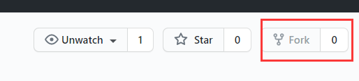
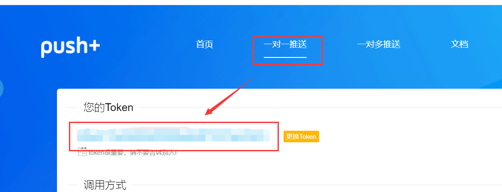
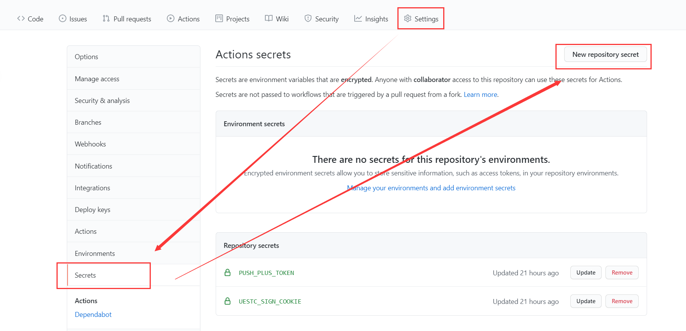
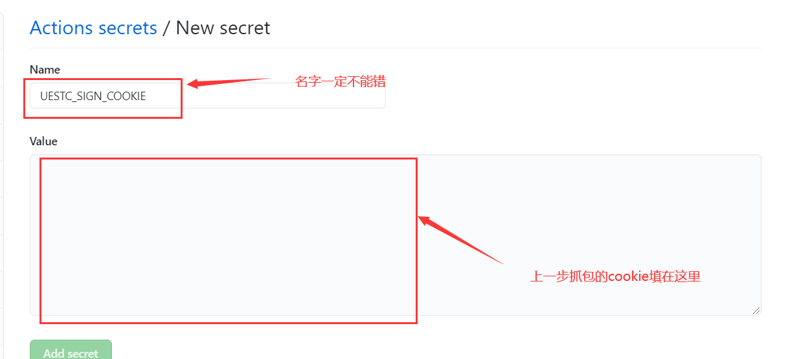
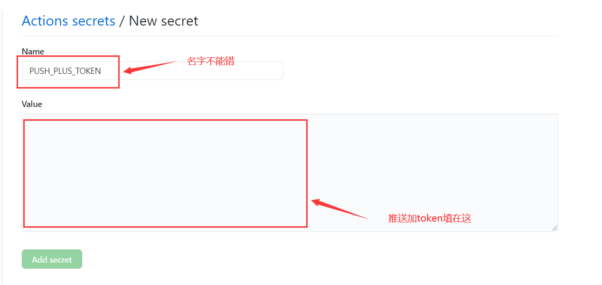
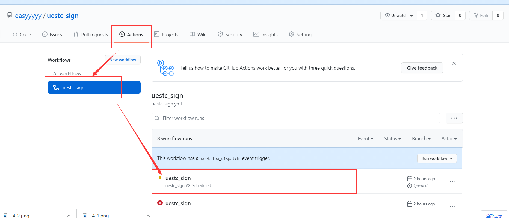
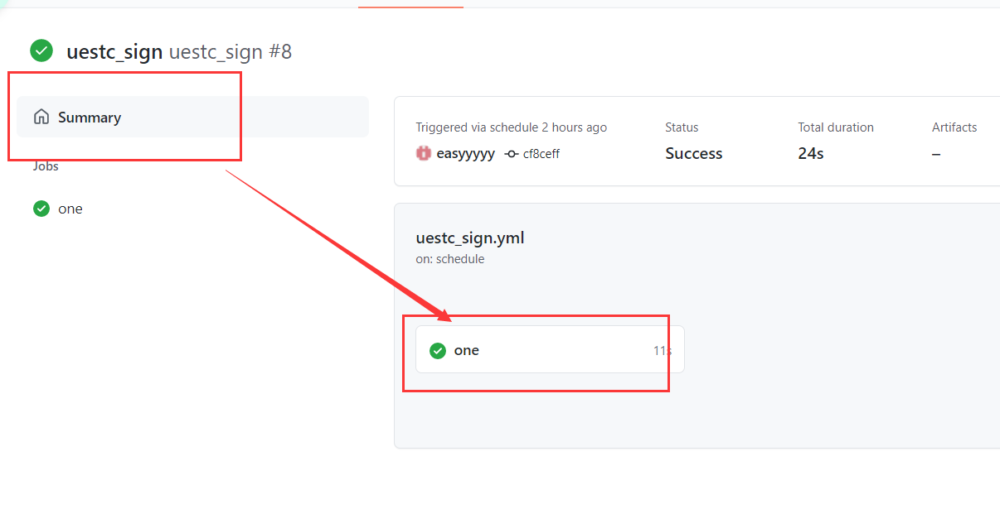
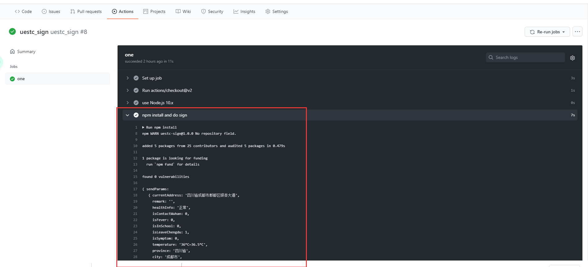

# UESTC学生情况报送签到脚本

**2021.6.19更新：添加了github actions**

**2021.6.17更新：添加了docker**

**如果有问题，欢迎提Issues**

**如果本项目对你有帮助，就点一个`Star`吧QAQ**

## 简介

- UESTC学生情况报送自动填报
- 每天0：05触发github actions，执行有延迟
- 填报结果会通过推送加推送到微信

## 相关链接

- fiddler抓包教程参考
  + [fiddler抓包](https://juejin.cn/post/6844904042422861831)

- pushplus token
  + https://pushplus.hxtrip.com/

## 食用方法

1. Forl仓库
   
   - 点击右上角的`Fork`，将项目Fork到自己的账号下
   
     
   
2. 获取环境变量
   - PC版微信打开uestc学生情况小程序抓包，推荐使用**fiddler**抓包[fiddler抓包](https://juejin.cn/post/6844904042422861831)
   
   - 在 [推送加官网](https://pushplus.hxtrip.com/)注册，拿到token
   
     
   
3. 添加

   - 回到自己的项目页面，依次点击`Settings`-->`Secrets`-->`New repository secret`

   

   - 将上一步抓包获取的cookie填入

     

   - 如需要微信通知，将推送加token填在这

     

   

4. 启动Action

   - 回到自己的项目页面，点击上方的`Actions`，允许启动 workflows

   - 点击`Enable workflow`允许actions执行

   - 可点击左侧`uestc_sign`，再点击`Run workflow`触发actions

   - 也可以等待每日0：05自动上报

   - 可查看执行日志

     

     

     


## 	其他方法（不推荐）
### docker
[docker部署方法](./docker/README.md)


### node定时任务

- 安装node
- 进入目录，安装依赖
  ```sh
  cd uestc_sign
  npm i
  ```

- 安装forever后台挂起node程序
  ```sh
  npm i forever -g
  ```
- 运行
  ```sh
  forever start -l /root/uestc_sign/logs/sign.log index.js
  ```


### crontab定时任务（linux用户）

- 使用crontab启动定时任务(node指令位置通过`which node`查看)
  ```sh
  crontab -e
  0 8 */1 * * /root/nvm/versions/node/v12.22.1/bin/node /root/uestc_sign/sign.js >> /root/uestc_sign/logs/sign.log 2>&1
  ```